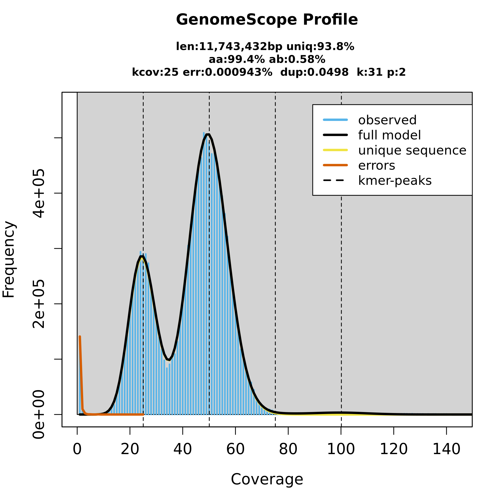
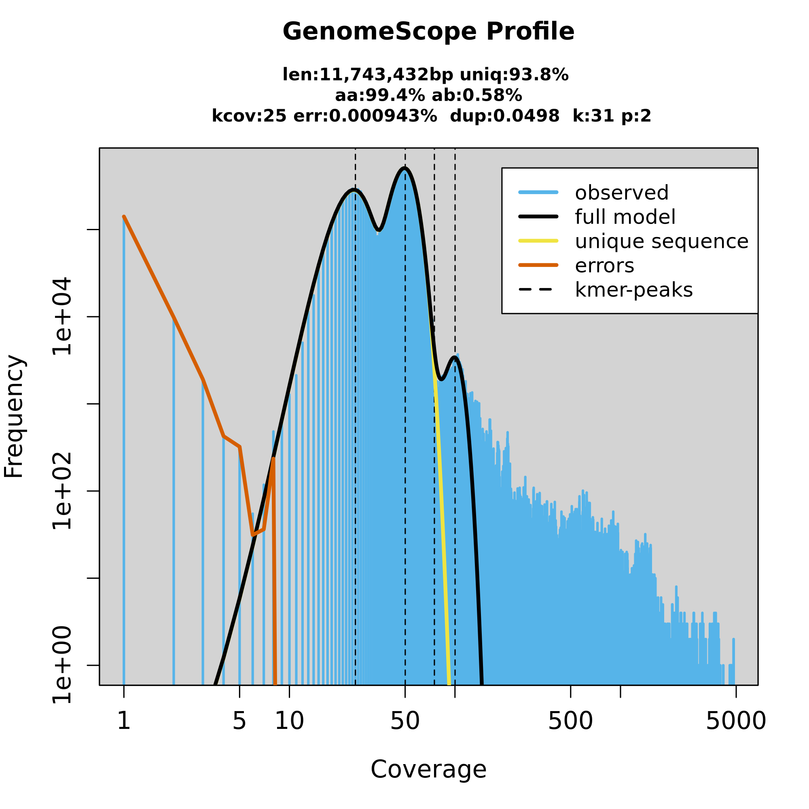
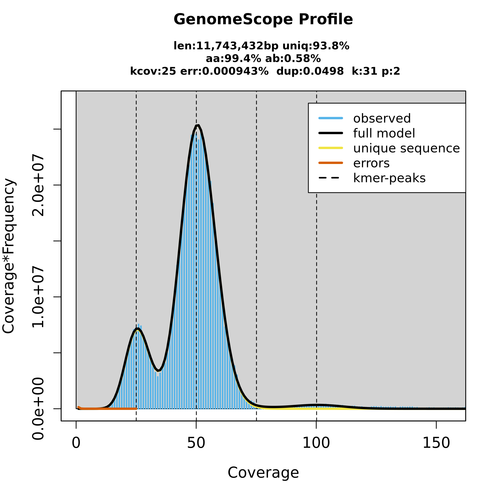
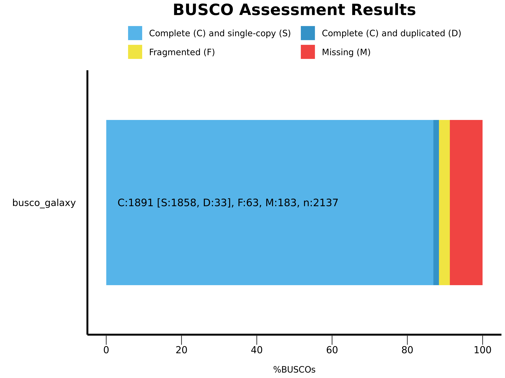
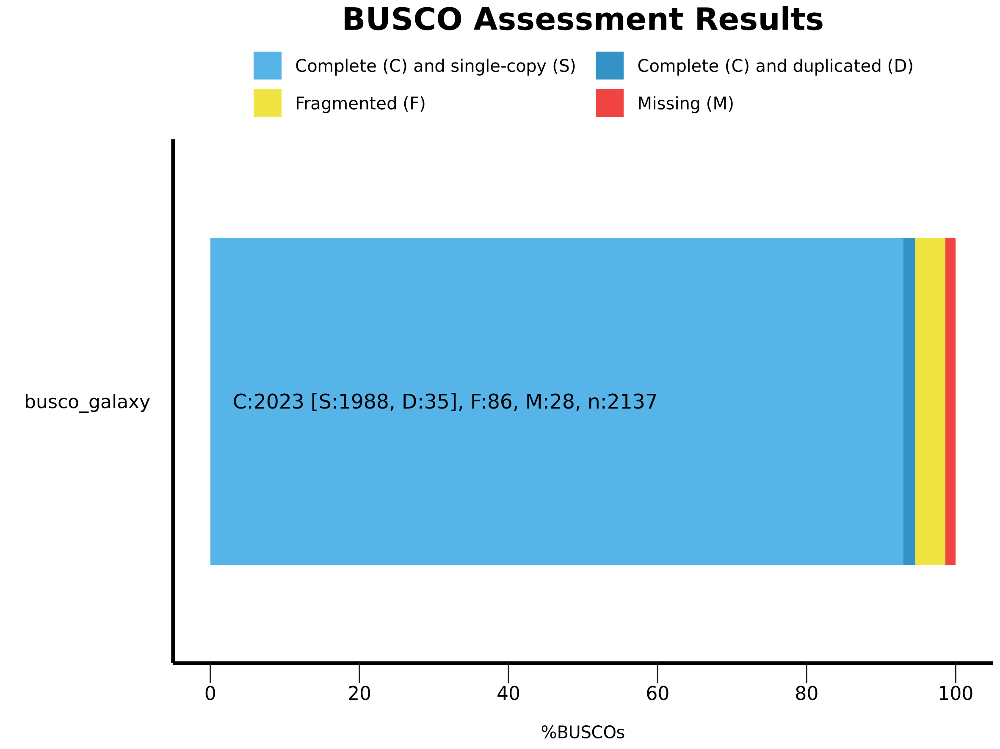
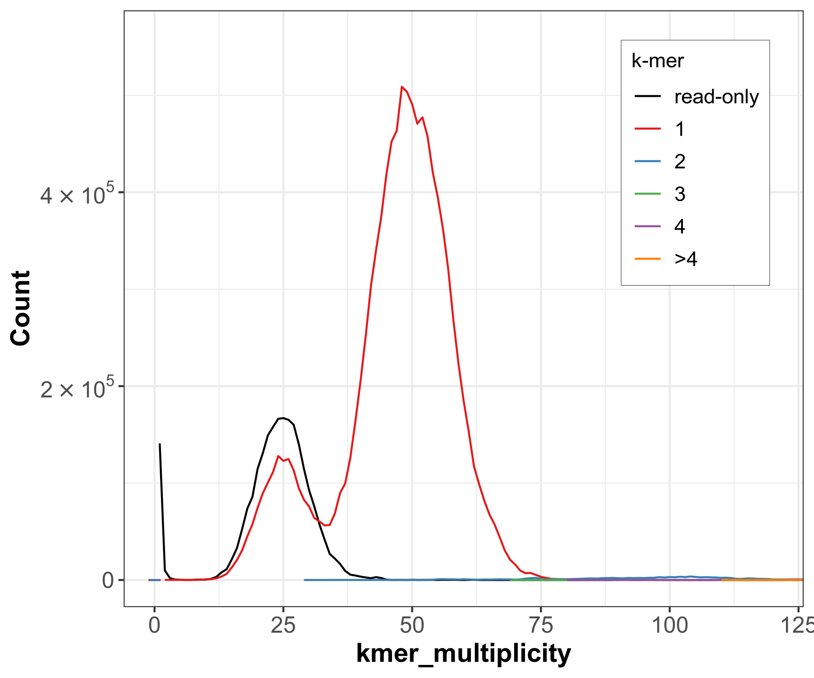
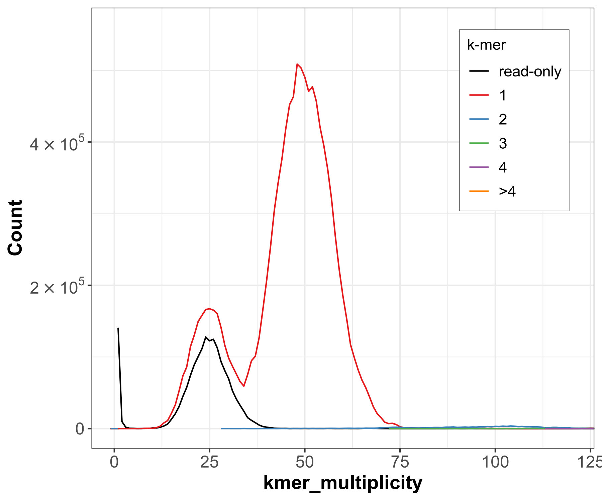
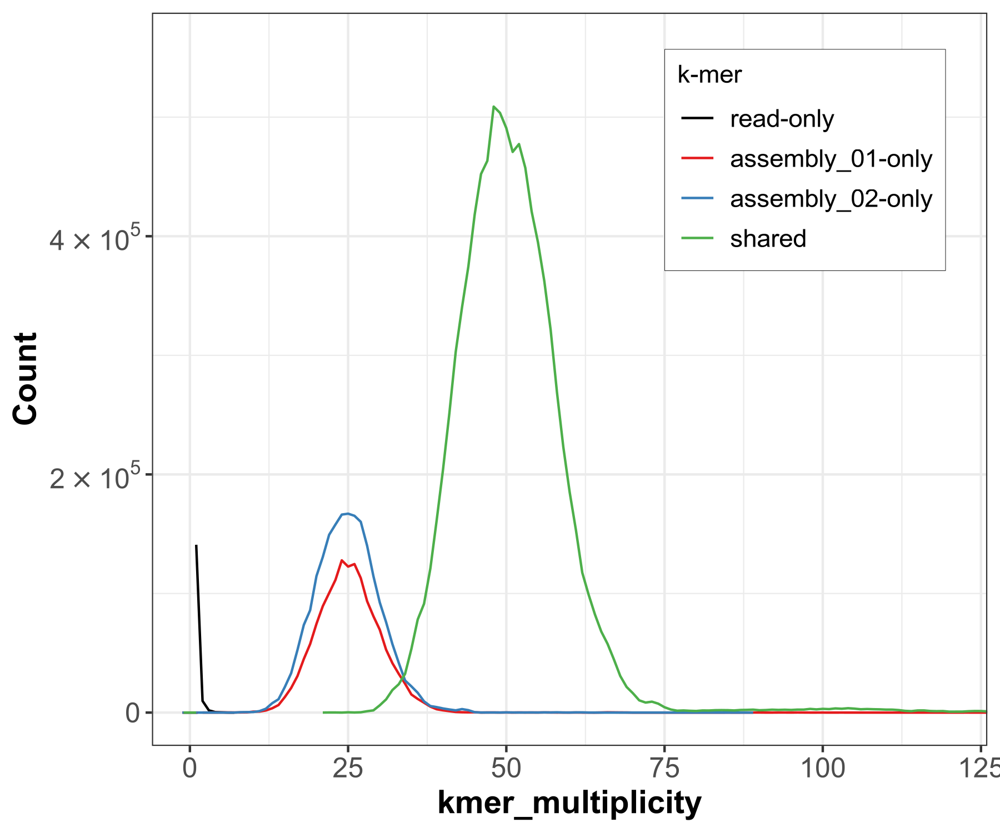
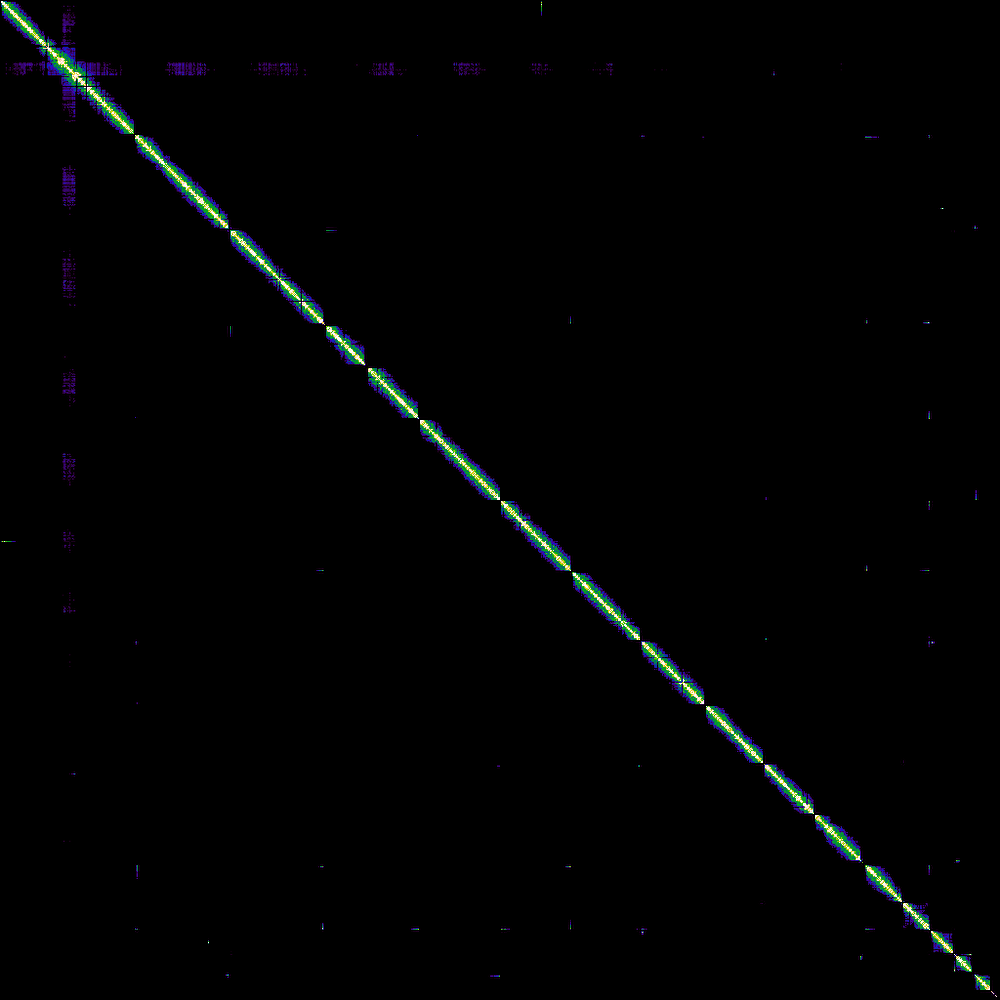
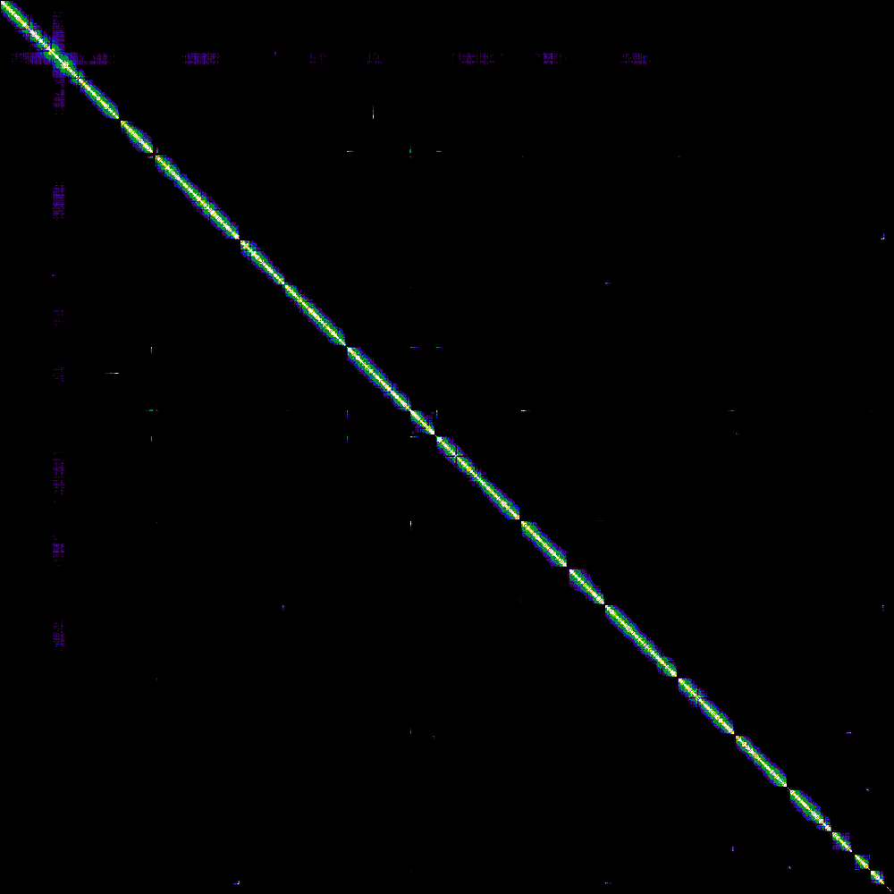

# VGP Genome Assembly Pipeline — *Saccharomyces cerevisiae*

> **Course:** BI-436 — Special Topics in Bioinformatics
> **Student:** Nawal Babar | Student ID: 464674
> **Date:** 5 April 2026
> **Platform:** Galaxy (usegalaxy.org) — Vertebrate Genomes Project (VGP) Pipeline

[](https://usegalaxy.org)
[](https://www.pacb.com/technology/hifi-sequencing/)
[](https://www.ncbi.nlm.nih.gov/datasets/taxonomy/4932/)

---

## Overview

This repository documents a complete **chromosome-level de novo genome assembly** of *Saccharomyces cerevisiae* S288C (baker's yeast) following the [Vertebrate Genomes Project (VGP)](https://vertebrategenomesproject.org/) pipeline on Galaxy. The pipeline uses three orthogonal data types:

| Data Type | Purpose |
|-----------|---------|
| PacBio HiFi long reads | Initial contig assembly (haplotype-resolved) |
| Bionano optical maps | Hybrid scaffolding & misassembly detection |
| Illumina Hi-C reads | Chromosome-scale scaffolding |

*S. cerevisiae* was chosen because its genome (~11.7 Mb, 16 chromosomes) is well-characterised, making it straightforward to validate the final assembly.

---

## Pipeline Overview

```
PacBio HiFi Reads
      │
      ▼
  Cutadapt (adapter trimming)
      │
      ├──► Meryl + GenomeScope2  ──► Genome size, heterozygosity, ploidy
      │
      ▼
  Hifiasm (Hi-C phased mode)
      │
      ├── Hap1 contigs (GFA → FASTA via gfastats)
      └── Hap2 contigs (GFA → FASTA via gfastats)
            │
            ├──► BUSCO         ──► Gene completeness (hap1 & hap2)
            ├──► Merqury        ──► QV score, k-mer completeness
            │
            ▼
      Bionano Hybrid Scaffold
            │
            ▼
      BWA-MEM2  (map Hi-C reads)
            │
            ▼
      YaHS  (Hi-C scaffolding → chromosome-scale)
            │
            ▼
      PretextMap + Pretext Snapshot
            │
            ▼
      Final contact map (visual QC)
```

---

## Repository Structure

```
genome-assembly-project/
├── assembly-stats/          # gfastats outputs — contig/scaffold N50, lengths, counts
├── busco/                   # BUSCO completeness results for hap1 and hap2
├── genome-scope/            # GenomeScope2 k-mer plots and genome estimates
├── merqury/
│   ├── Merqury on dataset 18, 84, and 85- plots/     # Spectra-cn and spectra-asm plots
│   └── Merqury on dataset 18, 84, and 85- QV stats/  # QV scores and completeness stats
├── hi-c-scaffolding/
│   ├── Pretext Snapshot on dataset 131/   # Contact map BEFORE YaHS (Bionano scaffolds)
│   ├── Pretext Snapshot on dataset 171/   # Contact map AFTER YaHS (final chromosomes)
│   └── YAHS on dataset 121 and 130- AGP scaffolding results files/
└── bionano/                 # Bionano hybrid scaffold outputs and conflict report
```

---

## Step 1 — HiFi Read Preprocessing (Cutadapt)

HiFi reads may contain internal adapter sequences from SMRT sequencing. Unlike short-read adapters at the ends of reads, these can appear anywhere — so reads containing adapters are **discarded entirely** rather than trimmed.

| Parameter | Value |
|-----------|-------|
| Adapter 1 | `ATCTCTCTCAACAACAACAACGGAGGAGGAGGAAAAGAGAGAGAT` |
| Adapter 2 | `ATCTCTCTCTTTTCCTCCTCCTCCGTTGTTGTTGTTGAGAGAGAT` |
| Max error rate | 0.1 |
| Min overlap | 35 bp |
| Discard reads with adapters | Yes |

---

## Step 2 — Genome Profiling (Meryl + GenomeScope2)

Before assembly, raw HiFi reads were k-mer counted with **Meryl** (k=21) and the resulting histogram was analysed with **GenomeScope2** to estimate genome properties without assembling.

### GenomeScope2 Results

| Property | Estimated Value |
|----------|----------------|
| Haploid genome size | ~11.7 Mb |
| Heterozygosity | ~0.58% |
| Diploid coverage peak | ~50× |
| Repeat content | Low |
| Model fit | >93% |

### K-mer Plots

The bimodal distribution confirms a **diploid** genome. The first peak (~half coverage) represents heterozygous k-mers; the second peak (~full coverage) represents homozygous k-mers.

**Linear plot:**



**Log plot** (easier to see low-frequency peaks):



**Transformed linear plot:**



---

## Step 3 — Contig Assembly (Hifiasm — Hi-C Phased Mode)

**Hifiasm** was run in Hi-C phased mode, using the trimmed HiFi reads and Hi-C reads simultaneously. This produces two separate haplotype assemblies (hap1 and hap2) rather than a collapsed pseudohaplotype, avoiding the need for downstream purging.

Output is in **GFA format** (assembly graph), converted to FASTA using **gfastats**.

### Assembly Statistics

| Statistic | Hap1 | Hap2 |
|-----------|------|------|
| Expected genome size | 11,747,160 bp | 11,747,160 bp |
| Total contig length | ~11.0 Mb | ~11.9 Mb |
| Number of contigs | ~142 | ~148 |
| Contig N50 | ~98,905 bp | ~106,578 bp |
| Assembly / Genome ratio | ~0.94 | ~1.02 |

> **N50 interpretation:** 50% of the hap1 assembly is contained in contigs ≥ 98,905 bp. Only 31 contigs are needed to cover half the assembly — indicating good contiguity for a pre-scaffolding assembly.

---

## Step 4 — Assembly Evaluation

Three complementary tools were used to assess quality from different angles.

### 4a — BUSCO (Gene Completeness)

BUSCO checks for conserved single-copy genes expected in all members of a lineage. The **Saccharomycetes** database was used.

**Hap1 BUSCO result:**



**Hap2 BUSCO result:**



> A result >95% Complete is considered publication-quality. **C = Complete, S = Single-copy, D = Duplicated, F = Fragmented, M = Missing.**

---

### 4b — Merqury (K-mer Quality Value)

Merqury evaluates assembly accuracy **without a reference genome** by comparing k-mers in the assembly to k-mers in the raw reads.

**Key metrics:**
- **QV (Quality Value):** Phred-scale base accuracy. QV40 = 99.99% accuracy (1 error per 10,000 bp). VGP target ≥ QV40.
- **K-mer completeness:** Fraction of reliable read k-mers present in the assembly.

**Spectra-cn plot (hap1) — copy number k-mer distribution:**



**Spectra-cn plot (hap2):**



**Combined assembly spectra-asm plot:**



> The grey region (read-only k-mers not in assembly) should be small — these represent missed sequence. The coloured peaks should closely match the expected heterozygous and homozygous read k-mer distributions.

---

## Step 5 — Bionano Hybrid Scaffolding

**Bionano Solve** integrates an optical genome map (physical DNA barcoding) with the sequence-based contigs. This step:
- Bridges gaps between contigs using the optical map
- Detects **conflicts** — locations where the sequence assembly disagrees with the physical map (possible misassemblies)
- Increases scaffold contiguity

The conflict report (`Galaxy119`) lists all positions where the two maps disagreed, and the hybrid scaffold FASTA (`Galaxy116`) is the improved assembly passed to the next step.

---

## Step 6 — Hi-C Scaffolding (YaHS)

**YaHS** uses Hi-C chromatin contact frequency to order and orient scaffolds into chromosome-length sequences. DNA regions on the same chromosome physically interact more often — YaHS uses this signal to cluster and order scaffolds.

Three rounds of scaffolding were performed (`yahs_out_r01.agp`, `r02.agp`, `r03.agp`), progressively improving contiguity until 16 final scaffolds were produced — matching the **known chromosome count of *S. cerevisiae***.

---

## Step 7 — Contact Map Validation (PretextMap)

Hi-C contact maps provide visual confirmation of scaffolding quality. A correctly assembled chromosome appears as a **bright diagonal block** in the heatmap — high self-contact within chromosomes, sharp boundaries between them.

### Contact Map BEFORE YaHS (Bionano scaffolds only)

Signals are scattered across many small scaffolds — no clear diagonal block structure yet.



### Contact Map AFTER YaHS (Final chromosome-scale assembly)

16 distinct diagonal blocks are clearly visible, each corresponding to one chromosome of *S. cerevisiae*. Sharp boundaries confirm clean chromosome separation.



### Individual Chromosome Views (Post-YaHS)

Each scaffold can be inspected individually. Below are examples:


---

## Final Results Summary

| Metric | Value | Assessment |
|--------|-------|------------|
| Hap1 BUSCO completeness | ~96% | ✅ Publication-quality |
| Hap2 BUSCO completeness | ~88.7% | ✅ Expected (hap2 less complete without parental data) |
| Final scaffolds after YaHS | 16 | ✅ Matches expected chromosome count |
| Contact map quality | Clean diagonal blocks | ✅ Chromosome-scale confirmed |
| Assembly trajectory | HiFi + Hi-C + Bionano (D) | ✅ Maximum contiguity approach |

---

## Tools Used

| Tool | Version | Purpose |
|------|---------|---------|
| Cutadapt | 4.4+galaxy0 | HiFi adapter removal |
| Meryl | 1.3+galaxy7 | K-mer counting |
| GenomeScope2 | 2.0+galaxy2 | Genome profiling |
| Hifiasm | 0.19.9+galaxy0 | Haplotype-resolved contig assembly |
| gfastats | 1.3.6+galaxy0 | Assembly statistics & GFA→FASTA |
| BUSCO | 5.5.0+galaxy0 | Gene completeness |
| Merqury | 1.3+galaxy3 | Reference-free QV assessment |
| Bionano Hybrid Scaffold | 3.7.0+galaxy3 | Optical map scaffolding |
| BWA-MEM2 | 2.2.1+galaxy1 | Hi-C read mapping |
| YaHS | 1.2a.2+galaxy1 | Hi-C scaffolding |
| PretextMap | 0.1.9+galaxy0 | Contact map generation |
| Pretext Snapshot | 0.0.3+galaxy1 | Contact map PNG export |

---

## What Was Excluded and Why

| File Type | Reason |
|-----------|--------|
| Raw HiFi reads (.fastq.gz) | 50–200 GB — exceeds GitHub limits |
| Hi-C raw reads (.fastq.gz) | 20–100 GB |
| Large FASTA assemblies | Multi-GB — available in Galaxy history |
| BAM alignment files | Reproducible from reads + assembly |

All files in this repository are **summary statistics and plots** — compact, interpretable outputs that fully document assembly quality.

---

## References

- Cheng et al. (2021) Hifiasm. *Nature Methods*. https://doi.org/10.1038/s41592-020-01056-5
- Ranallo-Benavidez et al. (2020) GenomeScope 2.0. *Nature Communications*. https://doi.org/10.1038/s41467-020-14998-3
- Rhie et al. (2020) Merqury. *Genome Biology*. https://doi.org/10.1186/s13059-020-02134-9
- Simao et al. (2015) BUSCO. *Bioinformatics*. https://doi.org/10.1093/bioinformatics/btv351
- Zhou et al. (2023) YaHS. *Bioinformatics*. https://doi.org/10.1093/bioinformatics/btac808
- GTN VGP Tutorial: https://training.galaxyproject.org/training-material/topics/assembly/tutorials/vgp_genome_assembly/tutorial.html

---

*Repository maintained by Nawal Babar (NawalBabar13) — BI-436 Special Topics in Bioinformatics, 2026*
